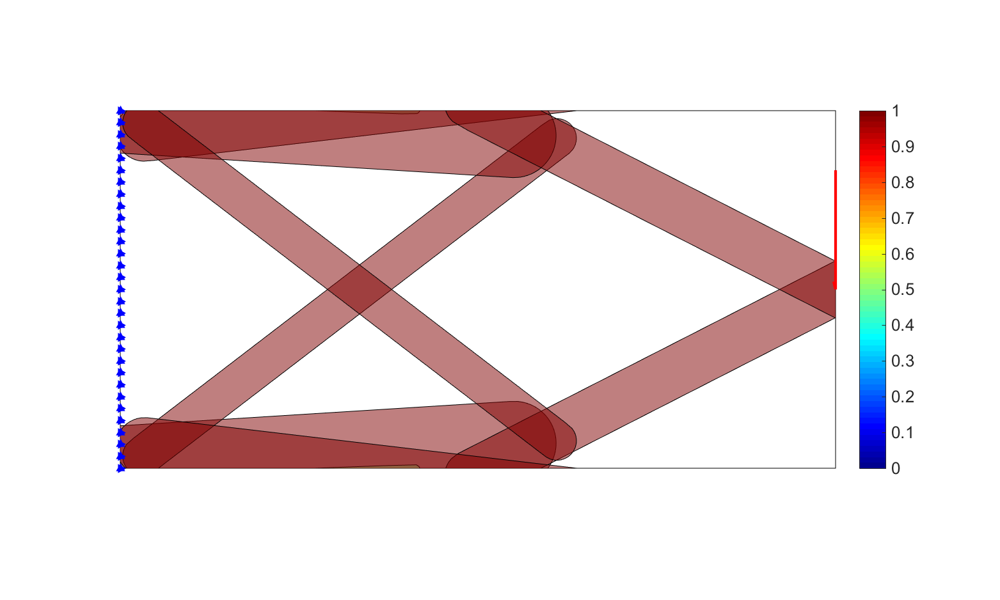
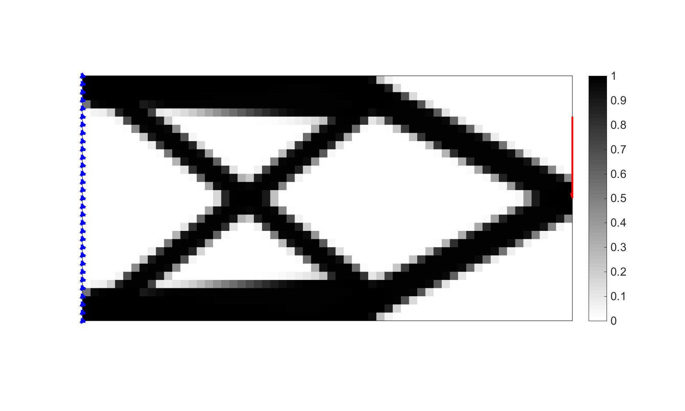

## Welcome to GGP

This web site is associated with the publication of Generalized Geometry Projection: a unified approach for geometric feature based topology optimization. Available on Springer journal [ACME](https://link.springer.com/article/10.1007/s11831-019-09362-8). 

[Preprint](https://hal.archives-ouvertes.fr/hal-02358693/document)

# Abstract
Structural topology optimization has seen many methodological advances in the past few decades. In this work we focus on continuum-based structural topology optimization and more specifically on geometric feature based approaches, also known as explicit topology optimization, in which a design is described as the assembly of simple geometric components that can change position, size and orientation in the considered design space. We first review various recent developments in explicit topology optimization. We then describe in details three of the reviewed frameworks, which are the Geometry Projection method, the Moving Morphable Components with Esartz material method and Moving Node Approach. Our main contribution then resides in the proposal of theoretical framework, called Generalized Geometry Projection, aimed at unifying into a single formulation these three existing approaches. While analyzing the features of the proposed framework we also provide a review of smooth approximations of the maximum operator for the assembly of geometric features. In this context we propose a saturation strategy in order to solve common difficulties encountered by all reviewed approaches. We also explore the limits of our proposed strategy in terms of both simulation accuracy and optimization performance on some numerical benchmark examples. This leads us to recommendations for our proposed approach in order to attenuate common discretization induced effects that can alter optimization convergence.

The framework is available for download in both Matlab, Julia and Python programming language.

# Recent presentations 

S. Coniglio, J. Morlier, C. Gogu, An introduction to Generalized Geometry Projection, a unified framework for feature-based topology optimization methods, WCCM-ECCOMAS 2020

Coniglio, S., Gogu, C., Amargier, R., & Morlier, J. (2019, May). Application of geometric feature based topology optimization to engine pylon architecture design including engine performance criteria. In 13th World Congress on Structural and Multidisciplinary Optimization.

G. Capasso, V. Bhat, S. Coniglio, J. Morlier, C. Gogu, Topology Optimization of Additive Layer Manufacturing products using Generalized Geometric Projection, WCCM-ECCOMAS 2020

G. Capasso, V. Bhat, S. Coniglio, J. Morlier, C. Gogu, Topology Optimization with Generalized Geometric Projection: extension to Additive Layer Manufacturing self- supported designs, In 13th Wolrd Congress on Structural and Multidisciplinary Optimization.

## Matlab Development 

see the code by S. CONIGLIO here:
[Matlab's topggp](https://github.com/topggp/GGP-Matlab)

## Python Development 

see the code by J. CRUZ-FERREIRA-MATOS here:
[Python's topggp](https://github.com/topggp/GGP-Python)

## Julia Development 

see the code by R. GRAPIN & J. MORLIER here:
[Julia's topggp](https://github.com/topggp/GGP-JULIA)

## Applications for Aerospace 

Tutorials available by V. BHAT and J. MORLIER

[Aerospace's topggp](https://github.com/topggp/GGP-Applications-for-Aerospace)

[Preprint:Towards a reproducible research in topology optimization of aerostructures](https://github.com/topggp/GGP-Applications-for-Aerospace/blob/main/CSMA2022-2.pdf)

Some unpublished Aerospace pylon applications of the method are available here in Simone's PhD manuscript)

@article{coniglio2019optimisation,
  title={Optimisation topologique {\`a} formalisme Eul{\'e}rien et Lagrangien appliqu{\'e}e {\`a} la conception d'un ensemble propulsif},
  author={Coniglio, Simone},
  year={2019}
}

Have a look to the video explaining the PhD [Simone's PhD](https://www.youtube.com/watch?v=pPm3LrmBew4) 

## Applications for ALM  

Tutorials  available by G. CAPASSO, V. BHAT S. CONIGLIO, C. GOGU and J. MORLIER

[ALM's topggp](https://github.com/topggp/GGP-for-Additive-Manufacturing)

[Preprint](https://hal.archives-ouvertes.fr/hal-03381445/document)

## Please Cite Us

If you happen to find GGP useful for your research, it will be appreciated if you cite us with:

Coniglio, S., Morlier, J., Gogu, C., & Amargier, R. (2019). Generalized Geometry Projection: A Unified Approach for Geometric Feature Based Topology Optimization. Archives of Computational Methods in Engineering, 1-38.

Bhat, K. V., Capasso, G., Coniglio, S., Morlier, J., & Gogu, C. (2021). On some applications of Generalized Geometric Projection to optimal 3D printing. Computers & Graphics.

or if you use Bibtex, you can use the following entry:

@article{coniglio2019generalized,
  title={Generalized Geometry Projection: A Unified Approach for Geometric Feature Based Topology Optimization},
  author={Coniglio, Simone and Morlier, Joseph and Gogu, Christian and Amargier, R{\'e}mi},
  journal={Archives of Computational Methods in Engineering},
  pages={1--38},
  year={2019},
  publisher={Springer}
}

@article{bhat2021some,
  title={On some applications of Generalized Geometric Projection to optimal 3D printing},
  author={Bhat, Krishnaraj Vilasraj and Capasso, Gabriele and Coniglio, Simone and Morlier, Joseph and Gogu, Christian},
  journal={Computers \& Graphics},
  year={2021},
  publisher={Elsevier}
}

